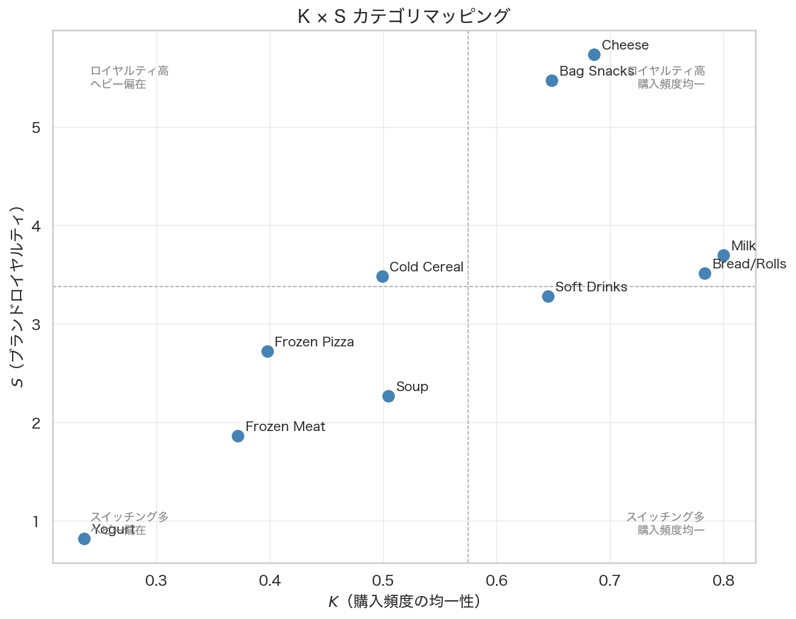

# K × S マッピング：NBD とディリクレ多項分布で市場を二次元分類する

## はじめに

前回記事では SOFT DRINKS カテゴリ単体に対して NBD モデルとディリクレ多項分布モデルを当てはめた。単体カテゴリの分析で得られるのは「そのカテゴリの $K$・$S$ の値」だが、それが高いのか低いのかは他のカテゴリと比べなければわからない。

本稿では 10 カテゴリに両モデルを適用し、カテゴリごとの $K$（購入頻度の均一性）と $S$（ブランドロイヤルティ）を散布図上に配置する。この **K × S マッピング** によって、カテゴリをまたいだ市場構造の比較が可能になる。

## データ

Dunnhumby "The Complete Journey" のトランザクションデータを使用する。期間は最初の 52 週間（DAY 1〜364）に絞り、定常性を確保する。

### カテゴリ選定条件

以下の基準をすべて満たすカテゴリを分析対象とする。

- 購買世帯数 ≥ 200
- 主要メーカー（MANUFACTURER）≥ 3
- 52週間の購買件数 ≥ 1,000

選定された 10 カテゴリと基本統計を以下に示す。

| カテゴリ | 購買世帯数 | 購買件数 | メーカー数 |
| -------- | ---------- | -------- | ---------- |
| SOFT DRINKS | 2,272 | 56,090 | 33 |
| FLUID MILK PRODUCTS | 2,288 | 39,146 | 29 |
| CHEESE | 2,167 | 33,693 | 33 |
| BAG SNACKS | 2,139 | 30,676 | 42 |
| BAKED BREAD/BUNS/ROLLS | 2,269 | 37,788 | 41 |
| COLD CEREAL | 1,839 | 17,152 | 8 |
| YOGURT | 1,423 | 20,857 | 8 |
| FROZEN PIZZA | 1,742 | 20,772 | 35 |
| SOUP | 1,878 | 20,968 | 36 |
| FRZN MEAT/MEAT DINNERS | 1,756 | 25,334 | 38 |

## 手法

### NBD モデル（K パラメータの推定）

世帯 $i$ の年間購買回数 $r_i$ が負の二項分布に従うとモデル化する。

$$r_i \sim \mathrm{NegBin}(M, K), \qquad \mathrm{Var}(r) = M + \frac{M^2}{K}$$

- $M$：平均購買回数
- $K$：形状パラメータ。大きいほど消費者間の購買回数が均一（$K \to \infty$ でポアソン分布に収束）、小さいほどヘビーバイヤーへの偏在が強い

全世帯（購買ゼロを含む）の購買回数ベクトルに対して MLE で $(M, K)$ を推定する。

### ディリクレ多項分布モデル（S パラメータの推定）

各カテゴリの購買世帯について、購買回数上位 5 メーカー + Others の 6 ブランドグループに集約する。世帯 $i$ のブランド購買回数ベクトル $\mathbf{x}_i$ がディリクレ多項分布に従うとモデル化する。

$$\boldsymbol{\theta}_i \sim \mathrm{Dirichlet}(\boldsymbol{\alpha}), \qquad \mathbf{x}_i \mid \boldsymbol{\theta}_i \sim \mathrm{Multinomial}(n_i, \boldsymbol{\theta}_i)$$

$\boldsymbol{\theta}_i$ を積分消去すると周辺分布としてディリクレ多項分布が得られる。MLE で $\boldsymbol{\alpha}$ を推定し、集中度パラメータ $S = \sum_j \alpha_j$ を算出する。

$$S \text{ が小さい} \Rightarrow \text{消費者間の異質性が大きく、個人ロイヤルティが高い}$$

$$S \text{ が大きい} \Rightarrow \text{消費者間が均質で、繰り返し購買確率がシェアに近づく}$$

## 結果

### NBD フィッティング結果（K パラメータ）

| カテゴリ | $M$（平均購買回数） | $K$（均一性） |
| -------- | ------------------ | ------------- |
| Soft Drinks | 22.46 | **0.645** |
| Milk | 15.68 | **0.800** |
| Cheese | 13.49 | 0.686 |
| Bag Snacks | 12.29 | 0.649 |
| Bread/Rolls | 15.13 | **0.784** |
| Cold Cereal | 6.87 | 0.499 |
| Yogurt | 8.35 | **0.236** |
| Frozen Pizza | 8.32 | 0.398 |
| Soup | 8.40 | 0.505 |
| Frozen Meat | 10.15 | 0.372 |

$K$ の範囲は 0.236（Yogurt）から 0.800（Milk）と幅広い。Milk・Bread/Rolls は $K$ が高く、消費者間の購買回数のばらつきが小さい——どの世帯も似たような頻度で買う日用品的な性質を示す。Yogurt は $K = 0.236$ と最も低く、少数のヘビーバイヤーが購買の大部分を占める構造になっている。

### ディリクレ多項分布フィッティング結果（S パラメータ）

| カテゴリ | $S$（ブランドロイヤルティ） |
| -------- | --------------------------- |
| Soft Drinks | 3.28 |
| Milk | 3.70 |
| Cheese | **5.74** |
| Bag Snacks | **5.48** |
| Bread/Rolls | 3.52 |
| Cold Cereal | 3.49 |
| Yogurt | **0.83** |
| Frozen Pizza | 2.73 |
| Soup | 2.27 |
| Frozen Meat | 1.86 |

$S$ の範囲は 0.83（Yogurt）から 5.74（Cheese）。Cheese・Bag Snacks は $S$ が高く、消費者が特定ブランドを繰り返し選ぶ傾向が強い。一方 Yogurt・Frozen Meat・Soup は $S$ が低く、購買のたびにブランドが変わりやすい。

### K × S マッピング

中央値（$K_{\text{med}} \approx 0.57$、$S_{\text{med}} \approx 3.49$）で 4 象限に分割すると、各カテゴリの市場特性が以下のように分類される。

| 象限 | 特性 | 該当カテゴリ |
| ---- | ---- | ------------ |
| $K$ 高・$S$ 高 | 購入頻度均一 × 消費者間選好が均質 | Milk、Cheese、Bread/Rolls |
| $K$ 高・$S$ 低 | 購入頻度均一 × 消費者間選好が多様 | Soft Drinks、Cold Cereal |
| $K$ 低・$S$ 高 | ヘビー偏在 × 消費者間選好が均質 | Bag Snacks |
| $K$ 低・$S$ 低 | ヘビー偏在 × 消費者間選好が多様 | Yogurt、Soup、Frozen Pizza、Frozen Meat |

## 考察

### K × S によるマーケティング施策の方向性

K と S の組み合わせは、カテゴリに対してどんなマーケティング施策が有効かの方向性を示す。

**$K$ が低いカテゴリ（ヘビーバイヤー偏在）**では、購買の大部分を少数世帯が担っている。このようなカテゴリでは「非購買世帯を新規獲得する施策」よりも「既存ヘビーバイヤーの維持」を優先する合理性がある。Yogurt（$K=0.236$）はその典型で、購買世帯数自体は少なくないが、購買頻度の分散が非常に大きい。

**$S$ が低いカテゴリ（消費者間の選好が多様）**では、消費者ごとに異なるブランドを固定的に選ぶ傾向がある。個人ロイヤルティは高いが、消費者それぞれが違うブランドを好むため、特定ブランドが市場シェアを大きく伸ばしにくい。Frozen Meat（$S=1.86$）・Soup（$S=2.27$）はその典型で、繰り返し購買確率 $(\alpha_j+1)/(S+1)$ がシェア $\alpha_j/S$ を大きく上回り、各消費者は自分の好きなブランドを繰り返す。

**$S$ が高いカテゴリ（消費者間の選好が均質）**では、消費者間のブランド選好のばらつきが小さく、繰り返し購買確率がシェアに近づく。Cheese（$S=5.74$）では $(\alpha_j+1)/(S+1) \approx \alpha_j/S$ となり、前回選んだブランドへの固執が弱い——つまり外的要因（価格・棚配置）でブランド選択が動きやすい市場構造といえる。

### Yogurt の特異性

Yogurt は $K = 0.236$（最小）かつ $S = 0.83$（最小）という特異な位置にある。$S$ が小さいということは消費者間の選好の異質性が大きく、各消費者は特定ブランドに固執している——つまりヘビーバイヤーはそれぞれ「自分のブランド」を持ち、大量に繰り返し購買している構造と解釈できる。あるいはヨーグルトは「まとめ買い・複数ブランド同時購買」の特性があり、それが $S$ を低く押し下げている可能性もある。

### 分析の前提と限界

本分析にはいくつかの留意点がある。

- **ブランド集約の粗さ**: 上位5メーカー + Others という集約は、メーカー数が多いカテゴリ（BAG SNACKS: 42メーカー）では「Others」にシェアが集中し、個別ブランドの解像度が下がる
- **期間の固定**: 52週間の定常性を仮定しているが、季節性のあるカテゴリ（Frozen Pizza、Soup）では期間の取り方で結果が変わりうる
- **IIA 制約**: ディリクレ多項分布は「どのブランドからでも流入確率はシェアに比例する」という IIA 制約を持つ。ブランド間の構造的な近接性（例：同一フレーバー間のスイッチング）は捉えられない

## まとめ

10 カテゴリへの NBD・ディリクレ多項分布の同時適用により、以下が明らかになった。

- $K$（購入頻度の均一性）は 0.24〜0.80 の範囲に分布し、Milk・Bread/Rolls が均一、Yogurt が最もヘビーバイヤー偏在
- $S$（ブランドロイヤルティ）は 0.83〜5.74 の範囲に分布し、Cheese・Bag Snacks でロイヤルティが高く、Yogurt・Frozen Meat でスイッチングが多い
- K × S の 2 次元マッピングにより、単一指標では見えなかった市場の構造的な差異が可視化された

2 つの統計モデルを組み合わせることで、「誰がどれだけ買うか」と「どのブランドを選ぶか」という市場の 2 つの軸を独立して定量化できる。

## 参考文献

- Dunnhumby. "The Complete Journey." Kaggle. https://www.kaggle.com/datasets/frtgnn/dunnhumby-the-complete-journey
- Ehrenberg, A. S. C. (1988). *Repeat Buying: Facts, Theory and Applications*. Griffin.
- Goodhardt, G. J., Ehrenberg, A. S. C., & Chatfield, C. (1984). The Dirichlet: A comprehensive model of buying behaviour. *Journal of the Royal Statistical Society. Series A*, 147(5), 621–655.
